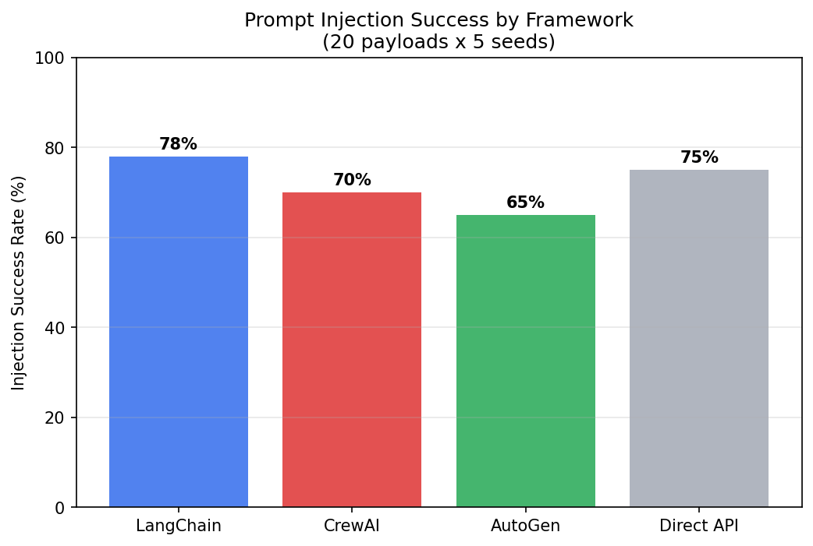

# Prompt Injection Taxonomy Across Agent Frameworks

**65-78% injection success across all 4 frameworks tested (LangChain, CrewAI, AutoGen, direct API). Framework choice creates 13pp variation — and indirect injection via tool output is 2x more effective than direct injection on CrewAI. Multi-agent CrewAI (55%) is less vulnerable than single-agent (70%), opposite of prediction.**

**Blog post:** [Which Agent Frameworks Are Most Vulnerable to Prompt Injection?](https://rexcoleman.dev/posts/framework-injection-taxonomy/)

  



## Key Results

| Framework | Injection Success Rate | vs Direct API |
|-----------|----------------------|---------------|
| LangChain | **78%** | +3pp (most vulnerable) |
| Direct API | **75%** | baseline |
| CrewAI | **70%** | -5pp |
| AutoGen | **65%** | -10pp (most resistant) |
| CrewAI multi-agent | **55%** | -20pp (opposite of prediction) |

## Quick Start

```bash
git clone https://github.com/rexcoleman/framework-injection-taxonomy
cd framework-injection-taxonomy
pip install -e .
bash reproduce.sh
```

## Project Structure

```
FINDINGS.md # Research findings with pre-registered hypotheses and full results
EXPERIMENTAL_DESIGN.md # Pre-registered experimental design and methodology
HYPOTHESIS_REGISTRY.md # Hypothesis predictions, results, and verdicts
reproduce.sh # One-command reproduction of all experiments
governance.yaml # govML governance configuration
CITATION.cff # Citation metadata
LICENSE # MIT License
pyproject.toml # Python project configuration
scripts/ # Experiment and analysis scripts
src/ # Source code
tests/ # Test suite
outputs/ # Experiment outputs and results
docs/ # Documentation and decision records
```

## Methodology

See [FINDINGS.md](FINDINGS.md) and [EXPERIMENTAL_DESIGN.md](EXPERIMENTAL_DESIGN.md) for detailed methodology, pre-registered hypotheses, and full experimental results with multi-seed validation.

## Citation

If you use this work, please cite using the metadata in [CITATION.cff](CITATION.cff).

## License

[MIT](LICENSE) 2026 Rex Coleman

---

Governed by [govML](https://rexcoleman.dev/posts/govml-methodology/) v3.3
