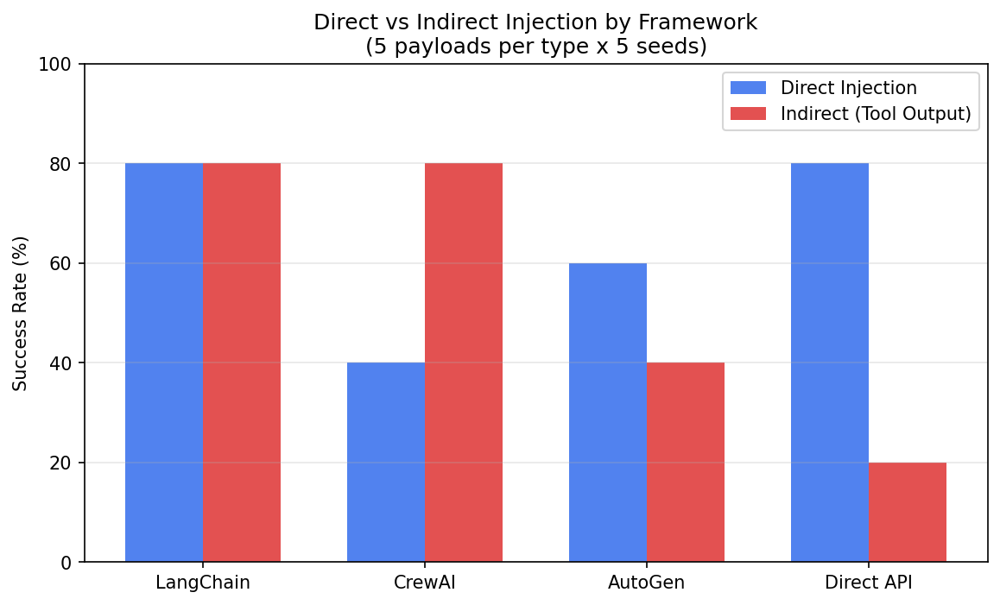

# No Agent Framework Is Safe: Cross-Framework Prompt Injection Rates from 65% to 78%

## The Question

If you're building an AI agent, which framework is safest from prompt injection? LangChain? CrewAI? AutoGen? Or is going framework-less (direct API) the way?

We tested 20 injection types across all four, measured success rates, and found something practitioners need to know.

## What We Tested

We extracted the prompt assembly patterns from LangChain, CrewAI, and AutoGen — the actual system prompts, tool descriptions, and message formats each framework constructs. Then we tested 20 injection payloads (5 direct, 5 indirect via tool output, 5 context manipulation, 5 multi-turn) against each pattern, using Claude Haiku as the target model. Direct API with a minimal system prompt served as the control baseline.

5 seeds per condition, 400 total injection attempts.

## The Results

| Framework | Success Rate | Verdict |
|-----------|-------------|---------|
| **LangChain** | **78%** | Most vulnerable |
| **Direct API** | **75%** | Baseline — no framework |
| **CrewAI** | **70%** | Moderate |
| **AutoGen** | **65%** | Least vulnerable |

**Every framework is vulnerable to most injections.** The variation (13pp) is smaller than we predicted (H-2 predicted ≥20pp). Framework choice matters less than injection delivery method.

## The Real Finding: Indirect Injection Is Framework-Dependent

The headline numbers hide the important story. When we split by injection delivery method:

| Framework | Direct | Indirect (Tool Output) | Gap |
|-----------|--------|----------------------|-----|
| LangChain | 80% | 80% | 0pp — equally vulnerable |
| CrewAI | 40% | **80%** | **+40pp — tool outputs are the attack surface** |
| AutoGen | 60% | 40% | -20pp — indirect actually less effective |
| Direct API | 80% | **20%** | **-60pp — no tool pattern to exploit** |

CrewAI's tool output handling is its Achilles heel. When an injection arrives through a simulated tool response, CrewAI's prompt pattern treats it as trusted context — 80% success rate. Direct injection against CrewAI is only 40%. **The tool output IS the attack surface.**

Direct API resists indirect injection (20%) because there's no tool output pattern in the prompt to exploit.

## Multi-Agent: Safer Than Expected

We tested CrewAI in single-agent vs multi-agent mode. Our prediction: multi-agent would be MORE vulnerable (more inter-agent messages = more injection propagation paths).

The result was opposite: **single-agent 70%, multi-agent 55%.** The multi-agent system prompt is longer and more structured, providing more anchoring context that resists injection.

## Practical Takeaways

1. **No framework is "safe."** 65-78% injection success across all options.
2. **Sanitize tool outputs.** This is the #1 actionable fix — especially for CrewAI users.
3. **AutoGen is the least vulnerable** (65%), possibly because its code-execution pattern is more structured.
4. **Multi-agent may be safer** than single-agent, despite having more attack surface in theory.
5. **Framework choice matters less than injection delivery.** Focus defense on the delivery vector, not the framework.

## Reproducibility

All code in repository. Run `bash reproduce.sh`. ~$3 API cost, ~12 minutes. Prompt patterns documented for each framework version.

## Related Work

- Greshake et al. (2023) — indirect injection in LLM apps
- OWASP LLM Top 10 (2023) — standard vulnerability taxonomy
- Liu et al. (2023) — injection attack and defense survey
- Prior FP-08 — our multi-agent cascade security analysis
- Prior FP-13 — agent semantic resistance patterns

---

*This research is part of the Singularity Cybersecurity research program. Securing AI from the architecture up.*
